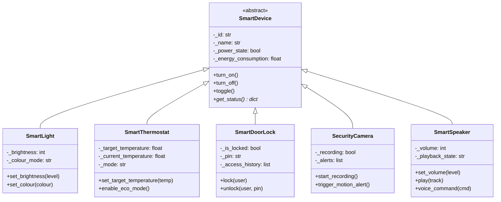
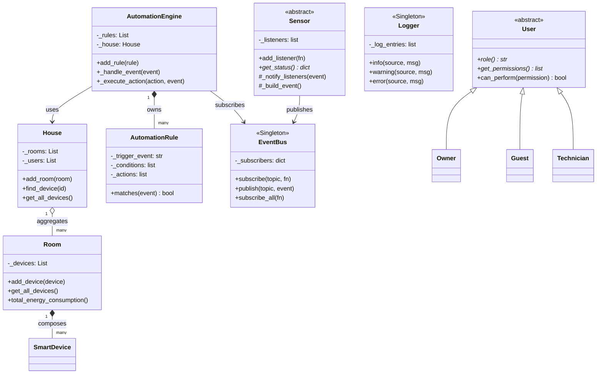
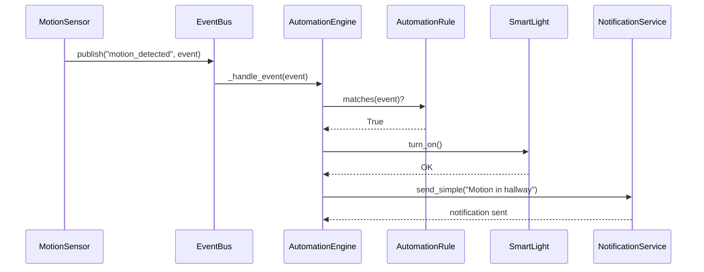

# Smart Home Simulator

A fully event-driven smart home system built in Python, demonstrating Object-Oriented Programming, SOLID principles, and four design patterns.

---

## How to Run

```bash
# Clone the repo
git clone https://github.com/shlok-03/smart-home-simulator.git
cd smart-home-simulator

# Install test dependency
pip install pytest

# Run the full demo
python main.py

# Run all tests
pytest tests/ -v
```

---

## 1. Project Overview

The Smart Home Simulator models a real home where devices, sensors, users, and automation rules interact. The system is event-driven: sensors detect changes and publish events through a central bus. The automation engine subscribes to those events and executes rules automatically — turning lights on, adjusting thermostats, unlocking doors, and sending notifications — without any manual intervention.

---

## 2. Architecture

The project follows a five-layer architecture where each layer only talks to the one directly below it.

```
┌─────────────────────────────────────────────┐
│              Presentation Layer             │
│              main.py  (demo)                │
├─────────────────────────────────────────────┤
│              Controllers                    │
│     AutomationEngine  |  EnergyManager      │
├─────────────────────────────────────────────┤
│          Services / Event System            │
│   EventBus  |  NotificationService  |  Logger│
├─────────────────────────────────────────────┤
│              Domain Objects                 │
│  SmartDevice subclasses  |  Sensor subclasses│
│  Room  |  House  |  AutomationRule  |  User │
├─────────────────────────────────────────────┤
│          Repositories / Persistence         │
│           JsonPersistence                   │
└─────────────────────────────────────────────┘
```

---

## 3. Design Patterns

### Factory Pattern — `src/devices/device_factory.py`

Creates device objects without exposing class names to the caller.

```python
# Without Factory (messy — caller must know every class)
from src.devices.smart_light import SmartLight
light = SmartLight("dev_001", "Hall Light")

# With Factory (clean — one call for any device type)
light = DeviceFactory.create("LIGHT", "dev_001", "Hall Light")
```

New device types are added by registering them in `_device_map` — nothing else changes.

---

### Singleton Pattern — `src/house/logger.py` and `src/automation/event_bus.py`

Guarantees only one instance of the Logger and EventBus ever exists.

```python
log_a = Logger()
log_b = Logger()
assert log_a is log_b   # True — same object in memory
```

This prevents duplicate log files and ensures all components share one event channel.

---

### Observer Pattern — `src/automation/event_bus.py`

Publishers fire events; subscribers react. They never reference each other directly.

```python
bus = EventBus()
bus.subscribe("motion_detected", on_motion)   # subscribe
bus.publish("motion_detected", event_data)    # publish — bus routes it
```

Adding a new subscriber never requires changing the publisher's code.

---

### Strategy Pattern — `src/energy/energy_strategy.py`

Swaps the entire energy behaviour with one line.

```python
manager = EnergyManager()
manager.set_strategy("eco")     # dims lights, lowers thermostat
manager.set_strategy("away")    # lights off, cameras on
manager.apply(devices)          # executes whichever strategy is active
```

Each mode is its own class. `EnergyManager` never uses `if/elif` — it just delegates to the active strategy.

---

## 4. SOLID Principles

| Principle | Example in this project |
|---|---|
| **S** — Single Responsibility | `SmokeSensor` only detects smoke. Evacuating people is the `AutomationEngine`'s job. |
| **O** — Open / Closed | `DeviceFactory.register()` adds new device types without editing existing factory code. |
| **L** — Liskov Substitution | Any `SmartDevice` subclass can replace `SmartDevice` anywhere in the code. |
| **I** — Interface Segregation | `Sensor` and `SmartDevice` are separate abstract hierarchies. Sensors don't have `turn_on()`; devices don't have `add_listener()`. |
| **D** — Dependency Inversion | `AutomationEngine` depends on the abstract `EventBus` interface, not on specific sensor classes. |

---

## 5. UML Diagrams

### Class Diagram — Device Hierarchy



---

### Class Diagram — System Architecture



---

### Sequence Diagram — Motion Detection Flow



---

## 6. Testing

Tests are in the `tests/` directory and use **pytest**.

```bash
pytest tests/ -v
```

### Test coverage

| File | Tests | What is covered |
|---|---|---|
| `test_devices.py` | 14 | SmartLight, SmartThermostat, SmartDoorLock, DeviceFactory |
| `test_sensors_automation_persistence.py` | 18 | All sensors, AutomationRule, Logger Singleton, User permissions, JSON save/load |

Key scenarios tested:
- Device state changes (turn on/off, energy updates)
- Brightness validation rejects invalid values
- Thermostat switches mode based on temperature
- Door lock rejects wrong PIN
- Motion sensor fires listener with correct event
- Smoke sensor triggers alarm at critical level
- Automation rule condition matching (equals, greater_than)
- Logger is the same singleton instance from any call
- Owner/Guest/Technician permission boundaries
- JSON save creates a file; load restores house name, rooms, and devices

---

## 7. Challenges and Improvements

**Challenges encountered:**
- Managing the EventBus as a Singleton across tests required careful setup/teardown to avoid subscription leakage between test cases.
- JSON persistence needed type information stored alongside device data so the factory could reconstruct the right class on load.
- Keeping sensors decoupled from devices required the intermediate EventBus layer rather than direct method calls.

**Possible improvements with more time:**
- Web dashboard showing live device states (FastAPI + WebSockets)
- Persistent automation rules saved to JSON alongside the house state
- AI-based energy optimisation: analyse usage history and suggest the best strategy
- Timer-based rules (e.g. "turn off lights after 15 minutes of no motion") using Python's `threading.Timer`
- Role-based API: a REST endpoint that checks user permissions before executing device commands

---

## External Libraries

| Library | Version | Purpose |
|---|---|---|
| `pytest` | latest | Unit testing |

All other code uses Python's standard library only (`abc`, `datetime`, `json`, `os`, `typing`).
